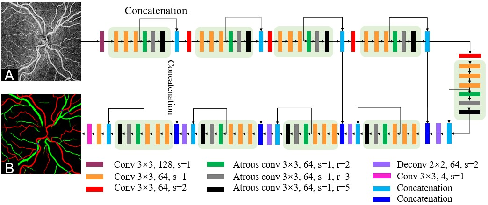
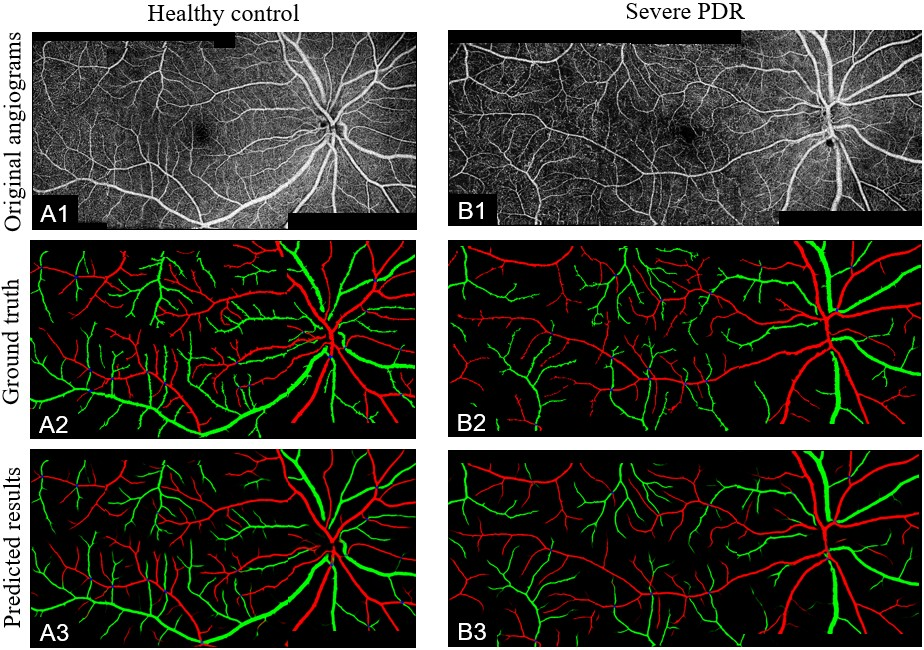
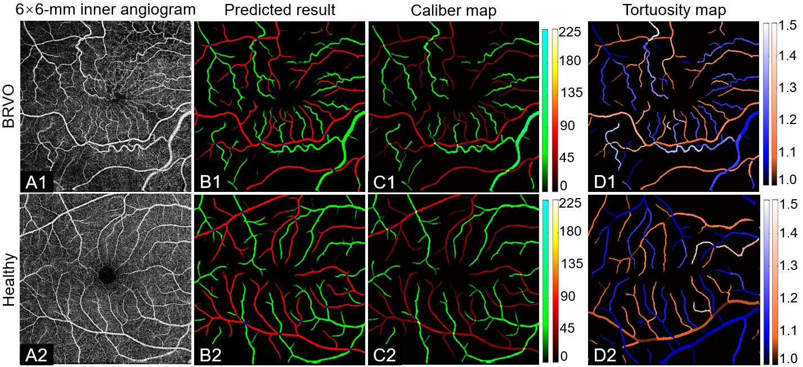
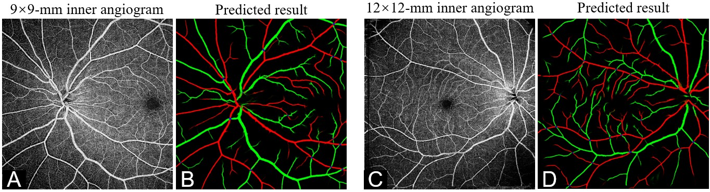

# Classification of arteries and veins in montaged wild-field OCT angiograms using a convolutional neural network 

[ [**OCTAngio Home Page**](https://octangio.github.io/) ]

By [**Min Gao**](https://author/profile/webpage), [**Yukun Guo**](https://author/profile/webpage), [**Tristan T.Hormel**](https://author/profile/webpage), [**Kotaro Tsuboi**](https://www.researchgate.net/profile/Kotaro-Tsuboi-2), [**George Pacheco**](https://www.linkedin.com/in/george-pacheco-bs-coa-32190a154), David Poole, [**Steven T. Bailey**](https://www.researchgate.net/profile/Steven-Bailey-10), [**Christina J. Flaxel**](https://orcid.org/0000-0001-9353-9862), [**Thomas S. Hwang**](https://www.researchgate.net/profile/Thomas-Hwang-2), [**Yali Jia**](https://scholar.google.com/citations?user=hfBY5K8AAAAJ&hl=en&oi=sra)

This repo is the official implementation of "Classification of arteries and veins in montaged wild-field OCT angiograms using a convolutional neural network".

## Introduction

Artery and vein abnormalities in the retina are important biomarkers for disease diagnosis. Distinguishing arteries from veins allows us to identify variation in the way disease affects each. In this study, we propose a convolutional neural network that classifies arteries and veins (CAVnet) on montaged wide-field optical coherence tomographic angiography (OCTA) en face images. This method takes the OCTA images as input and outputs the segmentation results with arteries and veins identified. We not only classify arteries and veins down to the level of precapillary arterioles and postcapillary venules, but also detect the intersection of arteries (or arterioles) and veins (or venules). The results show CAVnet has high accuracy on differentiating arteries and veins in diabetic retinopathy (DR) and branch retinal vein occlusion (BRVO) cases. These classification results are robust across two instruments and multiple scan volume sizes. Measurements of arterial and venous caliber or tortuosity made using our algorithm’s output show differences between healthy and diseased eyes, indicating potential benefits for disease diagnosis.

#### Figure 1. Algorithm flowchart.


## Getting Start

### Clone our repo

```bash
git clone git@github.com:octangio/CAVnet.git
cd CAVnet
```

### install packages

  ```bash
  pip install -r requirements.txt
  ```

### Train model on your own data

- prepare data
  
  The data set folder should be like the following structure.

    ```bash
    dataset
    |
    |-- train_image
    |   |
    |   |- image_0001.png
    |   |- image_0002.png
    |   |- ...
    |
    |-- train_label
    |   |
    |   |- label_0001.png
    |   |- label_0002.png
    |   |- ...
    |
    |-- valid_image
    |   |
    |   |- image_0001.png
    |   |- image_0002.png
    |   |- ...
    |
    `-- valid_label
        |
        |- label_0001.png
        |- label_0002.png
        |- ...
  ```

- Training
  
  ```bash
  python prepare_data.py --train_image=./dataset/train_image/_list.txt --train_label=./dataset/train_label/_list.txt --valid_image=./dataset/valid_image/_list.txt --valid_label=./dataset/valid_label/_list.txt --batch_size=2 --input_height=400 --input_width=400   
  ```
- Test

  ```bash
  python predict_results.py --test_data_path=./dataset/test_data_path --save_path=./dataset/AV_output --save_mat=./dataset/AV_out2mat --logdir=./logs/saved_model.hdf5
  ```
 #### Figure 2. Predicted results on healthy eyes and eyes with diabetic retinopathy.



 #### Figure 3. Predicted results on healthy eyes and eyes with branch retinal vein occlusion.



 #### Figure 3. Predicted results on scans with large-field-of view.


